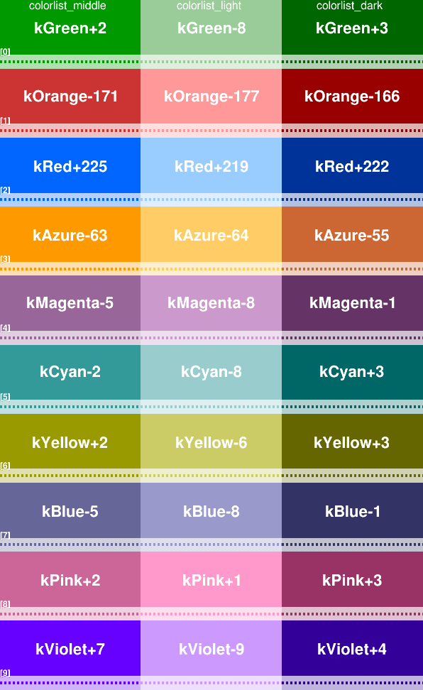
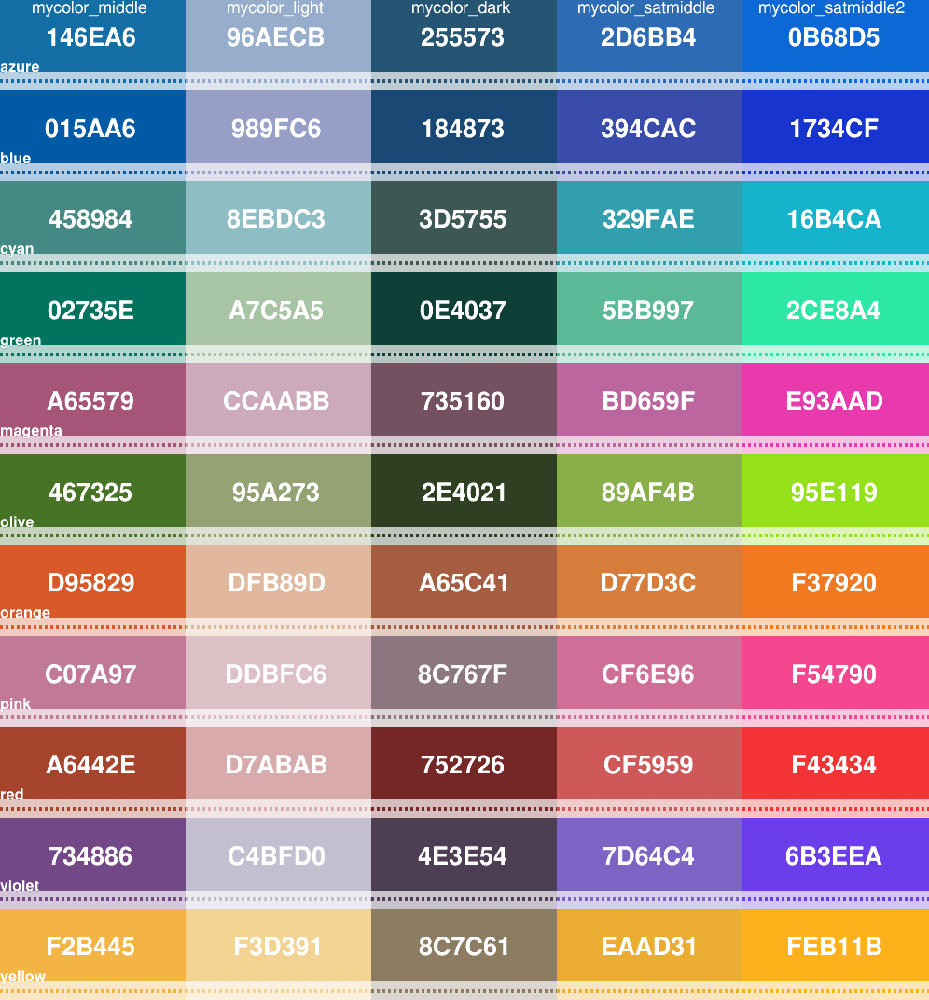

# Plot styling

- [Canvas Setting](#canvas-setting)
   - [Default canvas](#default-canvas)
   - [setgstyle](#setgstyle)
- [Color Library](#color-library)
   - [colorlist](#colorlist)
   - [mycolor](#mycolor)

## Canvas Setting
- [Default canvas](#default-canvas)
- [setgstyle](#setgstyle)
### Default canvas
```
#include "xjjrootuti.h"

TH2F* hempty = new TH2F("h", ";X Axis;Y Axis", 10, 0, 10, 10, 0, 10);
xjjroot::sethempty(hempty/*x-title-residual-offset, y-tittle-residual-offset*/);
xjjroot::setgstyle(); // details below
TCanvas* c = new TCanvas("c", "", 600, 600);
h->Draw("AXIS");
xjjroot::drawCMS(/*"#scale[1.25]{#bf{CMS}} #it{Preliminary}", "PbPb #sqrt{s_{NN}} = 5.02 TeV"*/);
```


### setgstyle()


## Color Library
- [colorlist](#colorlist)
- [mycolor](#mycolor)
### colorlist
std::vector<Color_t>: 
- colorlist_light
- colorlist_middle
- colorlist_dark
```
// e.g.
xjjroot::colorlist_middle[2]
```


### mycolor
std::map<std::string, int>: 
- mycolor_middle
- mycolor_light
- mycolor_dark
- mycolor_satmiddle
- mycolor_satmiddle2
```
// e.g.
xjjroot::mycolor_satmiddle["blue"]
```



